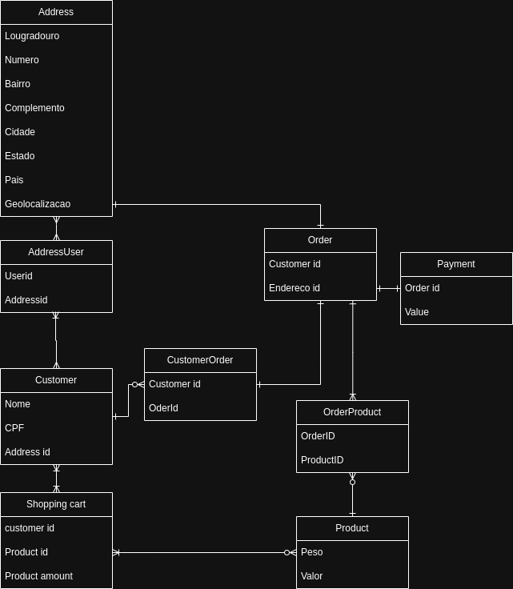

# Comentarios sobre o teste

## Como pensei

Comecei o teste desenvolvendo um modelo de relacao-entidade:  

Neste diagrama, fica simples a relação criada no backend. A ideia era
desenvolver um CRUD na rota "deliveries" (demonstrado no diagrama como Order),
que conteria informações do usuário e do seu endereço. A lógica do backend é a
seguinte: main -> router -> controller -> repositório, onde cada entidade
possui seu router, controller e repositório com uma validação simples.

O frontend foi feito em JavaScript, CSS e HTML de forma bem simples. Ele possui
todos os campos e envia uma requisição para criação de deliveries com os campos
e outras entidades requeridas.

## Notas extras

Sinto que me empolguei demais, e como nunca havia feito um teste técnico antes,
imaginei que o teste tinha alguns requisitos, mas que no final era um projeto
completo. Percebi isso perto do quinto ou quarto dia, quando já havia criado
todo o modelo e a lógica de como o backend iria funcionar. Ainda assim, espero
que gostem do projeto!

